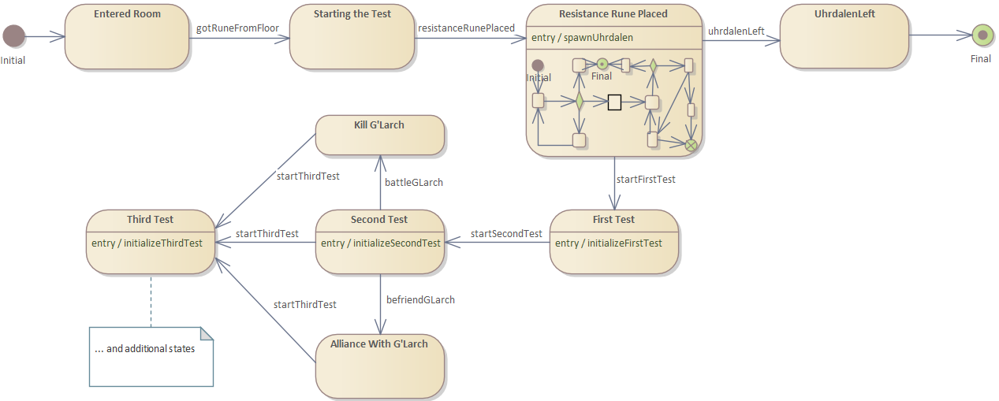

## State Machines

Imagine, if you will, that you want to make a quest. You want the quest to be
immersive - as a player goes through the quest, the world around them 
changes - the environments they walk through, the objects they find, the
encounters they have, and so on. As you go about writing the source code to 
make the vision become reality, a natural approach would be to have a bunch 
of branching (if or switch statements) that "control all the things". This 
works, but it doesn't take too many controlling variables to what can happen 
before this approach becomes unwieldy - it's at best case a 2<sup>N</sup> 
problem. If you've got a very linear plot for the quest, it's not a big deal 
as you might have a single variable moving you through the possible states. 
But, what happens if you can do various fragments in any order AND your 
adversaries are doing different things depending on your progression?
<br><br>
### Enter finite state machines. 
One of the tools that can be used for this is finite state machines. I'm 
partial to the UML representation for them (more info can be found at 
https://en.wikipedia.org/wiki/UML_state_machine)

In software development, there is a design methodology called 
"Model-based design" (https://en.wikipedia.org/wiki/Model-based_design) that's
often used to solve many of the problems facing controlling autonomous 
vehicles, building communication protocol stacks, and other things of that 
nature.

Many of the tools available allow you to draw a state machine diagram and, 
under the hood, it auto-generates all of the unwieldy branching for you 
behind the scenes. Another approach is to use a state machine framework.
For this mudlib, I created a UML-like state machine framework. It's not a
complete implementation - rather than implementing guards and choices, I
use an event-handling system / the expectation is to fire off an event to
initiate a transition to a new state - this implicitly handles guarding
against transition as well as choices. This may change in the future, but
thus far, this approach has proven sufficient in every use case I have had.

### Great, so how do I use it?
The first thing you should do is diagram what you want to accomplish. I'll
use an example from the tutorial section in this mudlib (/tutorials/temple).
In this example, I've got ~50 rooms that are controlled by the state machine,
a few NPCs, and a handful of other objects.


In this example, when a player enters a particular room, the quest is 
triggered. The player will see a wall that has fragments of a poem displayed
on its surface. There are several places on the wall where "pieces" appear to
be missing. The player sees a rune lying on the ground that appears to fit
perfectly in one of the gaps on the wall. When placed, an NPC appears and has
a conversation with the player. Depending on the player's choices, they will
either progress to the "first test" or the NPC will leave. If they go to the
first test, two puzzles will be set up, several objects placed, and the
rooms will all be updated with new exits, potentially new descriptions, and
so on. In the second test, there are several different choices to be made, all
with drastically different consequences, and so on...

An interesting caveat: the conversation framework that was implemented is
itself a state machine as are some of the puzzles implemented. It's very easy to
connect these composite states (state machines within states) to one another
by simply connecting them to the appropriate endpoint events.

### Building the state machine

There are several different classes to keep in mind when working with the state
machine framework:
- /lib/core/stateMachine.c: This implements the basic state machine 
functionality, making use of /lib/core/events.c, the event framework for the 
mudlib.
- /lib/modules/quests/questItem.c: This is an extension of the state machine 
framework (inherits /lib/core/stateMachine.c) and should be used as the main 
state machine for quests as it adds some functionality around auto-generating
"journal entries" for players based around the states they go through to
complete a given quest and provide some additional quest management features.
- /lib/environment/environment.c: optional state-specific arguments can be 
set on most environment setup methods to enforce setup only during specific
states. This includes adding exits, objects, descriptions, elemental objects,
harvestable resources, bonuses / modifiers to players, and so on.
- /lib/environment/environmentalElements.c: all of the "building blocks" for 
an environment (terrains, features, shops, items, and so on) can also have
their presence, description, and whatnot affected by the state of the owning
environment.

#### The state machine framework as extended by questItem

Using the state machine framework is pretty straightforward. In this section,
I'll dissect the method usage. To set up a questItem, simply inherit 
`/lib/modules/quests/questItem.c` and override its `protected void Setup()`
method. This method will be called at construction time, so any processing above
and beyond setting up the state machine can be added here too - just keep in
mind that it's only executed once.

- `setName(string name)` - this method will set the quest's name for you.
- `setType(string typeOfQuest)` - this method will set the type of the quest
for you. Valid options are: primary, secondary, guild, research, task, and 
background.
- `setDescription(string description)` - this method will set the descriptive
text and high-level "what this quest is about" type information. The
description is displayed when the player uses the `quests` command.
- `addState(string name, string description, <optional string isFinalState>)` -
this method will add a state to the state machine. The `name` argument will 
give the state a name to be used by subsequent setup methods, `description` 
will be used to generate a player "journal entry" when they have progressed
to/through this state, and the optional isFinalState parameter can be set to
`success` or `failure` if this is an end state. Using this optional parameter
is equivalent to additionally calling the `addFinalState(string state, 
string result)` method.
- `addEntryAction(string state, string functionName)` - this method will set 
an entry action for the specified state. IE: when this state becomes active,
this method is called. This method should be void and should have an
object as its lone parameter. When the transition occurs, the object that
initiated the transition (usually the player) will be passed. It is 
primarily used for custom processing when transition events
going to "connected" environments and objects are not sufficient.
- `addExitAction(string state, string functionName)` - this method will set 
an exit action for the specified state. IE: when this state is exited due to
a transition, this method is called. As with entry actions, this method 
should also be void and should contain an object parameter. It is primarily 
used for custom processing when transition events going to "connected" 
environments and objects are not sufficient.
- `addTransition(string fromState, string toState, string event)` - this 
method will set up a transition for you. In simplest terms, it would read
"when I am in `fromState` and receive `event`, transition to `toState`"
- `setInitialState(string state)` - this method will set the initial state
that the state machine is put in when the state machine is turned on via the
`startStateMachine()` method.
- `addFinalState(string state, string result)` - this method will add a 
final state - a state that terminates / exits the state machine when it is
reached. The result can be either `success` or `failure` - one use for this
is determining if a quest has been successfully completed or ended by the
player failing some task.
- `startStateMachine()` - When this method is called, it will prep the
state machine and register the requisite event handlers for all attached
objects. It will then transition the state machine to its initial state
and fire the `onStateChanged` event. This method can be called as the
action in the `Setup()` method or by any other object to start running
the state machine. This method must be called at some point for the 
state machine to function.
- `registerStateActor(object actor)` - this method can be used during setup
to control a custom object by the state machine during the machine's
lifetime. It can also be called during entry actions, or when events are
fired to temporarily connect an object to the state machine.
- `unregisterStateActor(object actor)` - this method can be used in an
exit action or when an event is fired in order to have the machine remove 
control of an object.
- `registerEventHandler(string event)` - If you need/want to hook the
firing of events to objects other than the state machine, you can use this
method (inherited by /lib/core/stateMachine from /lib/core/events.c)
- `notify(string event)` - If you need/want to broadcast the event `event`
during state processing, you can use this method (inherited by 
/lib/core/stateMachine from /lib/core/events.c) to do so.
- `receiveEvent(object caller, string event, object initiator)` - If you 
need/want to send an event from another object to the state machine at
any time, you can use this method (inherited by /lib/core/stateMachine 
from /lib/core/events.c) to do so. The first parameter is the state 
object doing so, the second is the event, and the third is the actor that
initiated the action - usually the player.

Putting this together, the diagramed state machine would look something like this:
```
inherit "/lib/modules/quests/questItem.c";

/////////////////////////////////////////////////////////////////////////////
private void registerEventHandlers()
{
    registerEventHandler("spawnUhrdalen");
    registerEventHandler("startFirstTest");
    registerEventHandler("startSecondTest");
    registerEventHandler("startThirdTest");
    registerEventHandler("startFourthTest");
    registerEventHandler("startFifthTest");
    registerEventHandler("startSixthTest");
    registerEventHandler("startSeventhTest");
}

/////////////////////////////////////////////////////////////////////////////
protected void Setup()
{
    setName("The Test of Obedience");
    setType("primary");
    setDescription("In order to retrieve the Heart of Decay, I have been "
        "tasked with completing something called the 'Test of Obedience'");

    addState("entered room", "I entered a room that appears to have "
        "been hewn out of solid amethyst.");

    addState("starting the test", "I found a strange rune on the floor.");
    addTransition("entered room", "starting the test", "gotRuneFromFloor");

    addState("resistance rune placed", "I was able to decipher a poem on a "
        "wall of runes. Several phrases are missing from it. The rune I "
        "found fit perfectly in one of the gaps.");
    addTransition("starting the test", "resistance rune placed", "resistanceRunePlaced");
    addEntryAction("resistance rune placed", "spawnUhrdalen");

    addState("uhrdalen left", "I pissed off an over-sensitive wraith. "
        "So... that's a thing and apparently I've hopelessly screwed up "
        "this quest. In the future, perhaps I should learn tact. Nah... "
        "piss off wraith. I hope you rot.");
    addTransition("resistance rune placed", "uhrdalen left", "uhrdalenLeft");
    addFinalState("uhrdalen left", "failure");

    addState("first test", "When I placed the rune, an ethereal being "
        "named 'Uhrdalen' spoke to me and assigned me the task of "
        "completing the poem on the wall of runes.");
    addTransition("resistance rune placed", "first test", "startFirstTest");

    addState("second test", "When I did more stuff, other things happened.");
    addTransition("first test", "second test", "startSecondTest");

    . . .

    setInitialState("entered room");
    startStateMachine();

    registerEventHandlers();
}

/////////////////////////////////////////////////////////////////////////////
void spawnUhrdalen(object player)
{
    notify("spawnUhrdalen", player);
}
```

#### Adding objects controlled by the state machine - Environments
After you create a state machine, the next step should be to set up all of the
objects that will be controlled by the state machine. I won't rehash all of the
methods available in environmental elements and environments. The documentation
for [/lib/environment/environmentalElements.c](terrain.md) and
[/lib/environment/environment.c](environments.md) can be viewed by following the
links. Where things can be controlled by the state machine, there is an
optional parameter shown for the method in question.

One example of how things work follows: Imagine that you have a state machine
and one of the tasks for the player is to shoot a target that's leaning against
a wall to a house. There's a window near it. If the player is a crappy shot,
and misses the target, then they break the window. Otherwise, the target gets 
hit. You could set up your environmental objects as follows:

Your target:
```
inherit "/lib/environment/items/baseItem.c";

/////////////////////////////////////////////////////////////////////////////
public void Setup()
{
    Name("target");

    addDescriptionTemplate("a target");
    addDescriptionTemplate("a target with an arrow in it", "hit target");

    . . .
}
```

Your window:
```
inherit "/lib/environment/items/baseItem.c";

/////////////////////////////////////////////////////////////////////////////
public void Setup()
{
    Name("window");

    addDescriptionTemplate("a window");
    addDescriptionTemplate("a shattered window", "missed target badly");

    . . .
}
```
Your environment:
```
inherit "/lib/environment/environment.c";

/////////////////////////////////////////////////////////////////////////////
public void Setup()
{
    setTerrain("/some/exterior.c");
    addItem("/your/target.c");
    addItem("/your/window.c");

    setStateMachine("/your/state/machine/path.c");
}
```
An important note: the state were NOT added in the environment. That's
because altering an environmental element is done within the context of
the environmental element. Deciding whether or not an environmental
element should be shown or a path exist are what would be displayed in
an environment. For example, let's say that a new exit is available if
the player hits the target, an arrow can be retrieved if the target is, 
and shards of glass and an angry homeowner are added if you fail:

New environment:
```
inherit "/lib/environment/environment.c";

/////////////////////////////////////////////////////////////////////////////
public void Setup()
{
    setTerrain("/some/exterior.c");
    addItem("/your/target.c");
    addItem("/your/window.c");

    addObject("/shards/of/glass.c", "missed target badly");
    addObject("/irate/homeowner.c", "missed target badly");
    addObject("/arrow/to/collect/from/target.c", "hit target");

    addExit("east", "/exit/if/you/hit/target.c", "hit target");

    setStateMachine("/your/state/machine/path.c");
}
```
Beyond these activities, you can also create event handlers in any/all objects
that are connected to the state machine. Going back to our questItem
implementation, recall the `void spawnUhrdalen(object player)` function at the
end of the state machine. In it, it calls `notify(...)`. If we want to do
something interesting in our environment, we simply create an event handler.
The event handler must be done in one of two formats:

- `public void yourEventName(object caller, object initiator, ...)` In this
example, the method to listen to that `notify("spawnUhrdalen", player);` 
call would be: `public void spawnUhrdalen(object stateMachine, object player)`

For example:
```
inherit "/lib/environment/environment.c";

/////////////////////////////////////////////////////////////////////////////
public void Setup()
{
    setInterior("/some/interior.c");
    addFeature("/some/feature.c");
    addItem("/some/item.c");

    . . .
    setStateMachine("/your/state/machine/path.c");
}

/////////////////////////////////////////////////////////////////////////////
public void spawnUhrdalen(object stateMachine, object player)
{
    Uhrdalen = clone_object("/tutorial/temple/characters/uhrdalen/uhrdalen.c");
    Uhrdalen->registerEvent(this_object());
    move_object(Uhrdalen, this_object());
    command("talk uhrdalen", player);
}
```